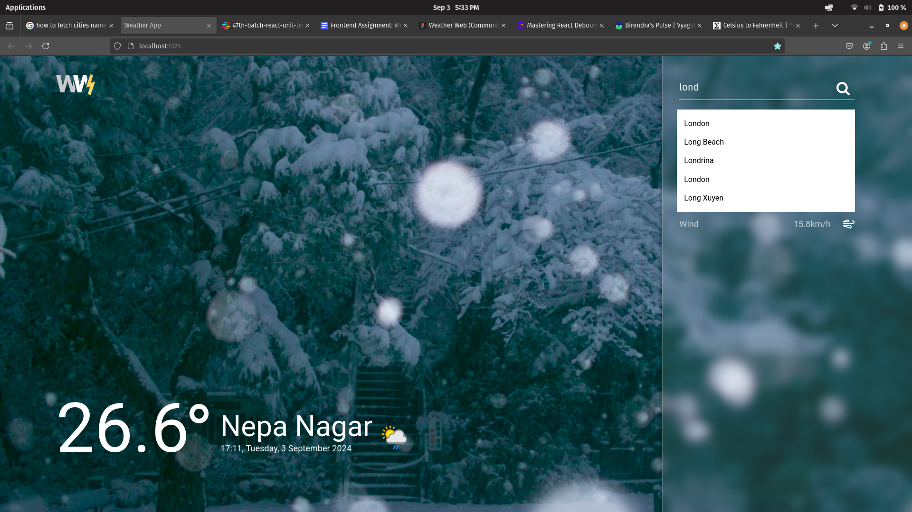

# Weather App

- User can see the weather (humidity, wind speed, cloud, current temperature along with local time of respestive cities) of different cities across the world.
- It shows name of cities as suggestion based on user input
- User can toggle between Celsius & Fahrenheit
- If user enter false city name, it shows proper message
- Background image will be changed based on weather condition

- [here is deployed link](https://weatherapp-zeta-three.vercel.app/)

